summary: Application Setup
id: application-setup
status: draft

# Application Setup

## Intro
Duration: 1

Welcome to this CodeLab!

Let's see how to set up the starter application provided by Amadeus

At the end of this codelab, you will know how this application is structured and how to add new features 

## Prerequisites
Duration: 2

Before we start, make sure you have the following:
- your favorite device (PC or Mac)
- Internet access
- [Node.js](https://nodejs.org) installed
- [Git](https://git-scm.com/) installed
- an IDE supporting frontend technologies (VSCode, IntelliJ, ...)
- some knowledge about Angular framework (we recommend doing the [Angular Tour of Heroes](https://angular.io/tutorial))

## Getting started
Duration: 3

Clone the repository [https://github.com/amadeus4dev-events/1ahack4sustainability-frontend](https://github.com/amadeus4dev-events/1ahack4sustainability-frontend)
```shell
git clone https://github.com/amadeus4dev-events/1ahack4sustainability-frontend
```

Move inside the created folder
```shell
cd 1ahack4sustainability-frontend
```

Install the dependencies using npm (included with Node.js)
```shell
npm install
```

Run the app in dev mode
```shell
npm start
```

Open your browser and navigate to [http://localhost:4200](http://localhost:4200)

Click on random buttons on the page and observe that things are happening

You are all set up!

## Presentation of the app
Duration: 4

The application is divided in 3 pages: 
- home
- inspire me
- search

### Page: Home

This is the default landing page of the app.

This page shows some text to explain the application

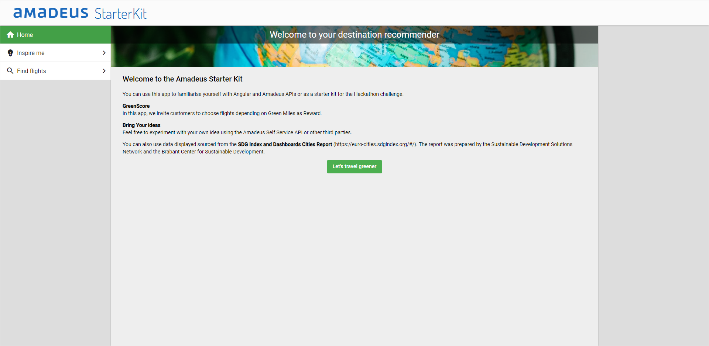

### Page: Inspire me

This page is used to choose a destination based on flavors (beach, nature, city) and green miles earned for each destination

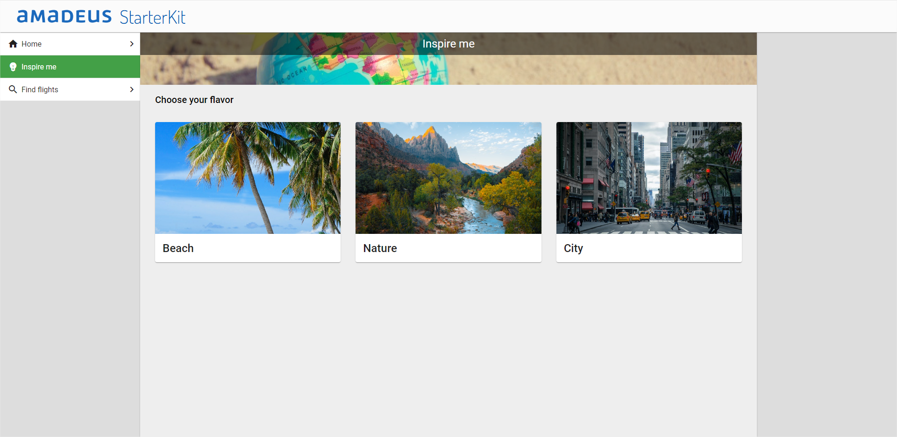

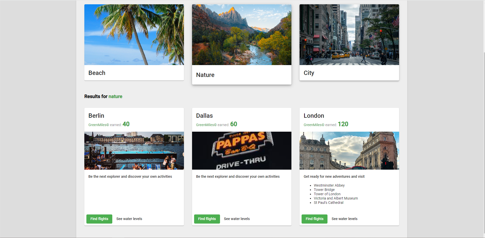

Positive
: To get the activities for each destination, we are using Amadeus Self Service API - [Points of Interest](https://developers.amadeus.com/self-service/category/destination-content/api-doc/points-of-interest/api-reference)

### Page: Search

This page is used to find flights for specific origin and destination

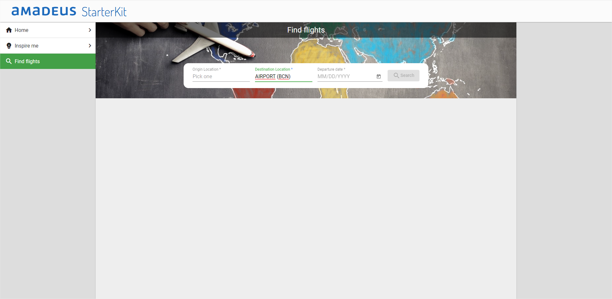

Positive
: To get the list of locations in the autocomplete fields we are using Amadeus Self Service API - [Airport and City Search](https://developers.amadeus.com/self-service/category/air/api-doc/airport-and-city-search/api-reference)

Once the search is validated, the flights are displayed bellow


Positive
: To get the list of flights we are using Amadeus Self Service API - [Flight Offers Search](https://developers.amadeus.com/self-service/category/air/api-doc/flight-offers-search/api-reference)

The details of the selected offer can be viewed either in "classic" mode or in "map" mode

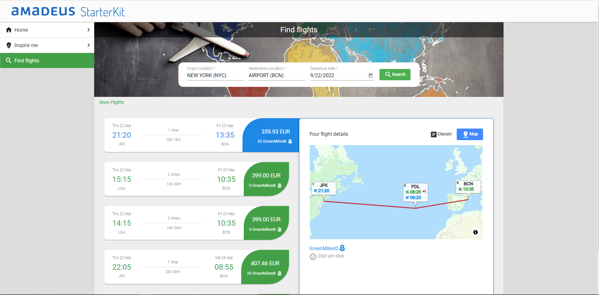

Positive
: The map is displayed using [Woosmap](https://www.woosmap.com/) library

## Structure
Duration: 5

Now, let's see how the code is structured

The project was generated using Angular CLI `ng new`. 
If you are already familiar with it, you should feel comfortable with the architecture

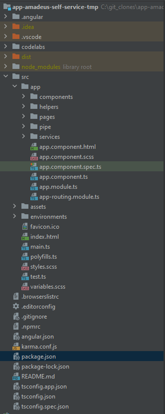

Let's see what each of these folders do:
- `.angular/`, `.git/`, `.idea/`, `.vscode/`: these are auto-generated folders, most likely you'll never have to do anything with them
- `codelabs/`: this is where this document code is located, don't hesitate to check if you are curious of how this is generated
- `dist/`: this is where the production app will be after you run `npm build`
- `node_modules/`: this is where npm installs all the dependencies of the app
- `src/`: this is where the source code of the app is
  - `src/app/components/`: here are all the reusable components
  - `src/app/helpers/`: some helper methods
  - `src/app/pages/`: here are the lazy module and main component of each page / route
  - `src/app/pipe/`: here are all the reusable pipes
  - `src/app/services/`: here all the services that we use for example to make the calls to the API
  - `src/assets/`: all the runtime assets (images, fonts, ...)
  - `src/environments/`: these are used to set specific values depending on the build environment (development / production)

## Adding new feature
Duration: 2

Now, let's add more stuff to this app

We are going to create a new page that will be accessed when selecting a flight offer

In this page we will display the weather for departure and arrival

This is what we want to achieve:


Let's get into it!

## Integrating third party API
Duration: 5

First we need to find an API that provides the data we want

Let's use this one [https://open-meteo.com/en](https://open-meteo.com/en), it doesn't require an API key, so it will be easier to use. Also, it is free

The format looks like the following:
```typescript
`https://api.open-meteo.com/v1/forecast?latitude=${lat}&longitude=${lng}&hourly=temperature_2m,weathercode&start_date=${day}&end_date=${day}`
```

To handle that, let's create a service using Angular CLI in the terminal:
```shell
ng g service --name=services/weather/weather
```

We can now add the code to call the API in our new service:

`src/app/services/weather/weather.service.ts`:
```typescript
export interface WeatherResponse {
  hourly: {
    time: string[];
    temperature_2m: number[];
    weathercode: number[]
  };
  hourly_units: {
    temperature_2m: string;
  };
}

@Injectable({
  providedIn: 'root'
})
export class WeatherService {

  /**
   * API call to retrieve the weather forecast for a location on a specific day
   */
  public async getWeather(latitude: number, longitude: number, day: string, timezone: string): Promise<WeatherResponse> {
      return (await fetch(`https://api.open-meteo.com/v1/forecast?latitude=${latitude}&longitude=${longitude}&hourly=temperature_2m,weathercode&start_date=${day}&end_date=${day}&timezone=${timezone}`)).json();
  }
}
```

Now, we have a method to get the weather forecast, nice!

Unfortunately, we need to send the `timezone` to the API, but we don't have that information :(

You know how it works now... let's find an API to get that data

This one looks just fine [http://www.geonames.org/export/web-services.html#timezone](http://www.geonames.org/export/web-services.html#timezone), we need to create an API key for this one (username in that case)

Positive
: We've already created one that you can use `test_1a_2022`

The format looks like the following:
```typescript
`http://api.geonames.org/timezoneJSON?lat=${latitude}&lng=${longitude}&date=${day}&username=test_1a_2022`
```

We could create a new service for that but for simplicity, let's just update our service:

`src/app/services/weather/weather.service.ts`:
```typescript

// ...

export interface TimezoneResponse {
  timezoneId: string;
}

@Injectable({
  providedIn: 'root'
})
export class WeatherService {

  // ...

  /**
   * API call to retrieve the timezone for location
   */
  public async getTimezone(latitude: number, longitude: number, day: string): Promise<TimezoneResponse> {
    return (await fetch(`http://api.geonames.org/timezoneJSON?lat=${latitude}&lng=${longitude}&date=${day}&username=test_1a_2022`)).json();
  }
}
```

Now we want a method to get the weather data only at the hour of our flight end point (location + datetime)

`src/app/services/weather/weather.service.ts`:
```typescript
export class WeatherService {
  constructor(private locationsService: LocationsService, private flightOffersService: FlightOffersService) {}

  /**
   * Chain API calls to get the weather forecast for a specific end point (location + datetime)
   */
  public async getWeatherForEndPoint(endPoint: FlightEndPoint) {
      const {latitude, longitude} = (await this.locationsService.getCoordinatesForAirportWithWoosmap(endPoint.iataCode))!;
      const day = JSON.stringify(endPoint.at).substring(1, 11);
      const hour = `${JSON.stringify(endPoint.at).substring(1, 14)}:00`;
      const timezone = await this.getTimezone(latitude!, longitude!, day);
      const response = await this.getWeather(latitude!, longitude!, day, timezone.timezoneId);
      const index = response.hourly.time.findIndex((t) => t === hour);
      return {
          temperature: response.hourly.temperature_2m[index],
          weatherCode: response.hourly.weathercode[index],
          weatherUnit: response.hourly_units.temperature_2m
      };
  }
  
  // ...
}
```

Basically, we are chaining 3 calls:
- `this.locationsService.getCoordinatesForAirport2` to get the latitude, longitude
- `this.getTimezone` to get the timezone of these coordinates
- `this.getWeather` to get the weather forecast

Once we have the data, we filter the results to keep only the hour of departure/arrival of the flight

Now, let's use this new method in our new page

## Creating a new page
Duration: 5

Let's see how we can create a new page on this application

We want to create a new route on path [http://localhost:4200/weather](http://localhost:4200/weather)

### Generate route

First we are going to generate the new route using Angular CLI in the terminal:
```shell
ng g module --module=app --routing=true --route=weather --name=pages/weather
```

This command generates all the files needed for this new route (one component and one lazy module)

This also updates the application routing module to include this new route

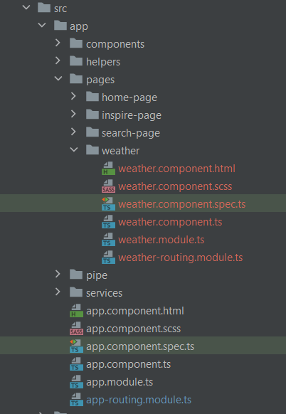

### Update navigation

Now, we want to update the NavigationComponent to include the new route in the UI

For that we can modify the file 

`src/app/components/navigation/navigation.component.ts`:
```typescript
export class NavigationComponent {

    navigationItems = [
        {label: 'Home', icon: 'home', path: '/home'},
        {label: 'Inspire me', icon: 'emoji_objects', path: '/inspire'},
        {label: 'Find flights', icon: 'search', path: '/search'},

        // Add new route here:
        {label: 'Weather', icon: 'sunny', path: '/weather'}
    ];
}
```

And that's it!

Now you can see your new page and navigate to it:

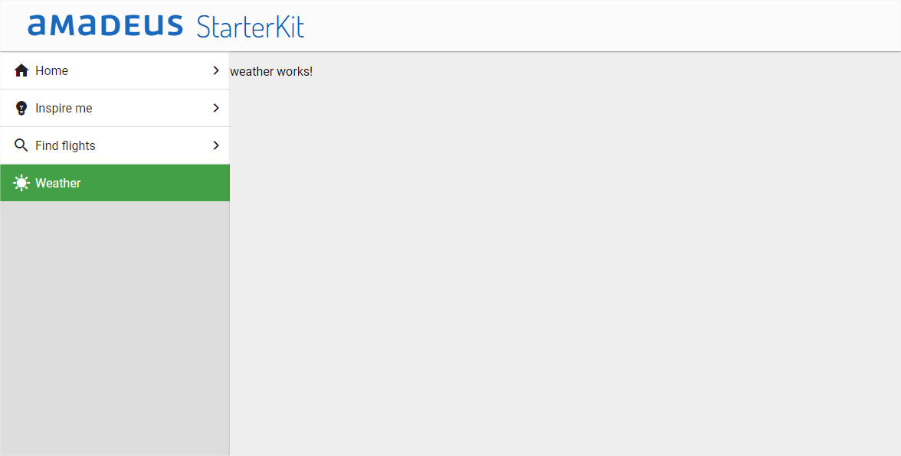

Let's also create a button in flight details component to select a flight and navigate to our new page

`src/app/components/flight-details/flight-details.component.html`
```html
<div class="container" *ngIf="flightItinerary">
  ...

  <button mat-flat-button color="primary" [routerLink]="'/weather'" [state]="{flightItinerary: flightItinerary}">Select</button>
</div>
```
Don't forget to import the router module in your component !
We'll use the state to pass the selected offer data to the new page

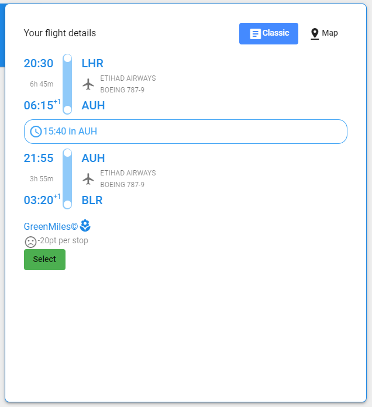

## Creating a new component
Duration: 5

Let's create a new component

First, we want to create a module to isolate the component and make it reusable

This module will contain the imports of all the dependencies needed for this component

```shell
ng g module --name=components/location-weather
```

Now, we can create the component and declare it in our module

```shell
ng g component --name=components/location-weather --module=components/location-weather --export
```

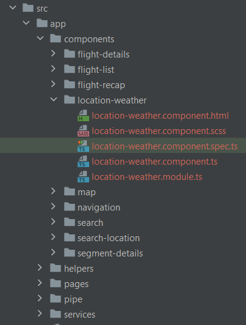

Positive
: To use this component you can directly type the selector `app-location-weather` in your template and your IDE should update the imports automatically

Negative
: If not, you need to import the new component module in the module of the component using it

Let's add some code in our new component to use our service

`src/app/components/location-weather/location-weather.component.ts`:
```typescript
export class LocationWeatherComponent implements OnInit {

  @Input()
  endPoint!: FlightEndPoint;

  weather$!: Observable<{temperature: number, weatherCode: number, weatherUnit: string}>;

  isLoading$!: Observable<boolean>;

  constructor(private weatherService: WeatherService) {
  }

  ngOnInit(): void {
    this.weather$ = from(this.weatherService.getWeatherForEndPoint(this.endPoint)).pipe(shareReplay(1));
    this.isLoading$ = merge(of(true), this.weather$.pipe(map(() => false)));
  }
  
  getIconForWeatherCode(weatherCode: number) {
    if (weatherCode < 1) return 'sunny';
    if (weatherCode < 4) return 'partly_cloudy_day';
    else if (weatherCode < 58) return 'cloudy';
    else if (weatherCode < 68) return 'rainy';
    else if (weatherCode < 78) return 'snowing';
    else if (weatherCode < 83) return 'rainy';
    else if (weatherCode < 87) return 'snowing';
    else return 'thunderstorm';
  }

  getLabelForWeatherCode(weatherCode: number) {
    if (weatherCode < 1) return 'Clear sky';
    else if (weatherCode < 4) return 'Mainly clear, partly cloudy, and overcast';
    else if (weatherCode < 49) return 'Fog and depositing rime fog';
    else if (weatherCode < 56) return 'Drizzle: Light, moderate, and dense intensity';
    else if (weatherCode < 58) return 'Freezing Drizzle: Light and dense intensity';
    else if (weatherCode < 66) return 'Rain: Slight, moderate and heavy intensity';
    else if (weatherCode < 68) return 'Freezing Rain: Light and heavy intensity';
    else if (weatherCode < 76) return 'Snow fall: Slight, moderate, and heavy intensity';
    else if (weatherCode < 78) return 'Snow grains';
    else if (weatherCode < 83) return 'Rain showers: Slight, moderate, and violent';
    else if (weatherCode < 87) return 'Snow showers slight and heavy';
    else if (weatherCode < 96) return 'Thunderstorm: Slight or moderate';
    else return 'Thunderstorm with slight and heavy hail';
  }
}
```

The component take the flight end point as @Input, it exposes 2 Observables:
- `weather$` will emit the weather data associated to our end point using our service
- `isLoading$` will emit a boolean to know when the call are ongoing or finished

Now, let's update our template to use those

`src/app/components/location-weather/location-weather.component.html`:
```html
<mat-card>
  <div mat-card-title>{{endPoint.iataCode}}, {{endPoint.at | date: 'E dd MMM HH:mm'}}</div>
  <div mat-card-content>
    <mat-spinner *ngIf="isLoading$ | async" [color]="'primary'"></mat-spinner>
    <ng-container *ngIf="weather$ | async as weather">
      <div class="temperature"><mat-icon [inline]="true" [fontSet]="'material-symbols-sharp'">{{getIconForWeatherCode(weather.weatherCode)}}</mat-icon> | {{weather.temperature}} {{weather.weatherUnit}}</div>
      <div>{{getLabelForWeatherCode(weather.weatherCode)}}</div>
    </ng-container>
  </div>
</mat-card>
```

Positive
: We are using Angular Material components here. If you are unfamiliar with it, you may want to take a look at the documentation [https://material.angular.io/](https://material.angular.io/)

Note that in the example above, for simplicity we directly used the component methods to compute the data to display.
This is actually not a good practice. Angular is not able to check if the application will return the same data for the same input.
Hence, it will re-evaluate it on each round of the Angular lifecycle whether the parameters changed or not.

If you want to avoid this pitfall and if you methods is predictable and always returns the same value for the same parameters,  
you can move the logic of the method inside an Angular Pipe.

Let's see how we can update the weather label to make it better.

`src/app/components/location-weather/location-weather.component.html`:
```html
<mat-card>
  <div mat-card-title>{{endPoint.iataCode}}, {{endPoint.at | date: 'E dd MMM HH:mm'}}</div>
  <div mat-card-content>
    <mat-spinner *ngIf="isLoading$ | async" [color]="'primary'"></mat-spinner>
    <ng-container *ngIf="weather$ | async as weather">
      <div class="temperature"><mat-icon [inline]="true" [fontSet]="'material-symbols-sharp'">{{getIconForWeatherCode(weather.weatherCode)}}</mat-icon> | {{weather.temperature}} {{weather.weatherUnit}}</div>
      <div>{{weather.weatherCode | weatherLabel}}</div>
    </ng-container>
  </div>
</mat-card>
```

`src/app/pipe/weather-label/weather-label.pipe.ts`:
```typescript
import { PipeTransform } from '@angular/core';

@Pipe({
  name: 'weatherLabel'
})
export class WeatherLabelPipe implements PipeTransform {
  transform(weatherCode) {
      if (weatherCode < 1) return 'Clear sky';
      else if (weatherCode < 4) return 'Mainly clear, partly cloudy, and overcast';
      else if (weatherCode < 49) return 'Fog and depositing rime fog';
      else if (weatherCode < 56) return 'Drizzle: Light, moderate, and dense intensity';
      else if (weatherCode < 58) return 'Freezing Drizzle: Light and dense intensity';
      else if (weatherCode < 66) return 'Rain: Slight, moderate and heavy intensity';
      else if (weatherCode < 68) return 'Freezing Rain: Light and heavy intensity';
      else if (weatherCode < 76) return 'Snow fall: Slight, moderate, and heavy intensity';
      else if (weatherCode < 78) return 'Snow grains';
      else if (weatherCode < 83) return 'Rain showers: Slight, moderate, and violent';
      else if (weatherCode < 87) return 'Snow showers slight and heavy';
      else if (weatherCode < 96) return 'Thunderstorm: Slight or moderate';
      else return 'Thunderstorm with slight and heavy hail';
  }
}
```

Do not forget to export this new pipe in a module and to import it in your weather component module.

## Wrapping up
Duration: 2

Last step, let's update our page component to use this new component

`src/app/pages/weather/weather.component.ts`:
```typescript
export class WeatherComponent {

  flightItinerary: Itineraries;

  constructor(router: Router) {
    this.flightItinerary = router.getCurrentNavigation()?.extras.state?.['flightItinerary'];
  }
}
```

`src/app/pages/weather/weather.component.html`:
```html
<ng-container *ngIf="flightItinerary">
  <app-location-weather [endPoint]="flightItinerary.segments[0].departure!"></app-location-weather>
  <app-location-weather [endPoint]="flightItinerary.segments[flightItinerary.segments.length - 1].arrival!"></app-location-weather>
</ng-container>
```

We retrieve the flight itinerary from router state and use our new component to display the weather for departure and arrival

Everything should be working now, well done

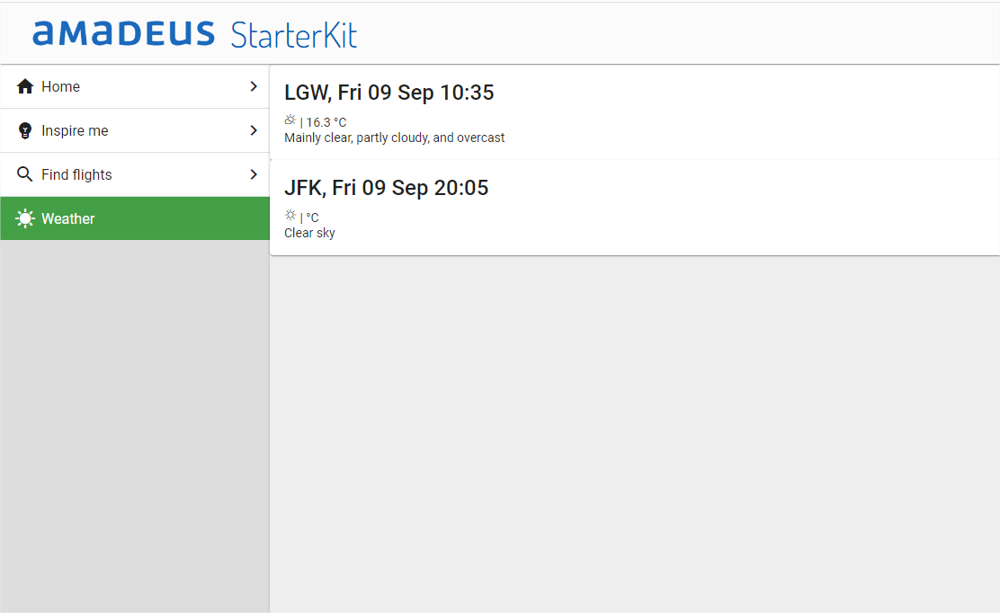

Close enough, we just need to add some css

`src/app/components/location-weather/location-weather.component.scss`:
```scss
.temperature {
  font-size: 1.25rem;
  font-weight: bold;
}
```

`src/app/pages/weather/weather.component.scss`:
```scss
:host {
  padding: 2rem;
  display: block;
}

app-location-weather {
  margin-bottom: 1rem;
  display: block;
}
```

Ok now it's really finished


Mission accomplished!

## Conclusion
Duration: 1

We hope you now have everything you need to use this app and make it more awesome

Enjoy the event!
